# 10 Ejemplos de C
<sub>Algunos con graphics.h</sub>

Este repo recopila **10 ejemplos basicos** de C que yo **Kmz Kuro** he logrado aprender a lo largo del curso de **fundamentos de programacion**. Dentro de si, encontraremos programas que haran uso de la libreria **<graphics.h>** esto requiere de que configures tu entorno de desarrollo de forma correcta, pero no te preocupes si no lo sabes hacer, aqui mismo te mostrare como hacerlo dependiendo de si usas **Visual Studio Code** o **Dev-C++**

## Configurar tu entorno de desarrollo

### Dev-C++

Dev C++ es una IDE que te permite codificar, compilar y ejecutar tu codigo de C/C++, esta se instala a traves de [Este enlace](https://sourceforge.net/projects/orwelldevcpp/files/latest/download).

Sigue los pasos de instalacion y seguido de esto podras configurar la IDE a tu gusto. Este a diferencia de Visual Studio Code no requiere de otras instalaciones y configuraciones complejas ya que por si mismo trae incorporado el compilador y todo lo necesario para poder ejecutar tu codigo.

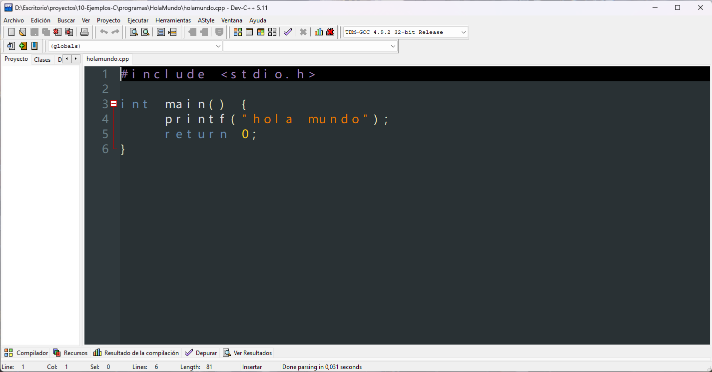

Para compilar y ejecutar dentro de este IDE presionaremos en el cuadro de colores rojo, verde, azul y amarillo y con este se estara ejecutando.

### Visual studio code

#### Instalacion de MinGW64.

Este es un entorno que contiene GCC el cual es el compilador de c y c++, este es necesario para la interpretacion y ejecucion del codigo c/c++.\
Para instalarlo puedes visitar https://winlibs.com/ y en la parte donde vienen las descargas instalar el zip correspondiente dependiendo de tu sistema.

> A partir de aqui me he equivocado en una cosa, no se va a usar la version de 64 bits, sino la de 32 debido a que graphics.h unicamente puede ejecutarse sobre 32 bits...\
> El procedimiento es el mismo sin embargo en vez de mingw64 sera mingw32, en la imagen es el zip que esta arriba del marcado.

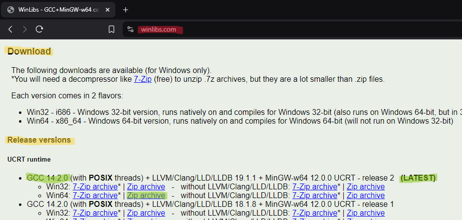

Una vez hayas descargado el zip tendras que extraer la carpeta que se encuentra dentro del zip en tu unidad **C**, de modo que quede **c:/mingw32**.

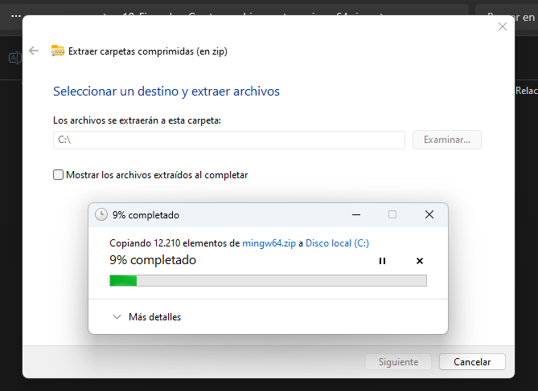

Una vez el proceso haya terminado, copiaremos la ruta `C:\mingw32\bin` y seguido de esto abriremos las variables del entorno escribiendo en la barra de busqueda de nuestro sistema operativo "Variables del entorno", esto mostrara la siguente opcion `Editar las variables del entorno del sistema` haremos clic en esa opcion, esto nos desplegara un cuadro llamado `Propiedades del sistema`.

Dentro del cuadro presionaremos la opcion `Variables del entorno` que nos abrira otro cuadro, **mucho cuidado con mover otras cosas que no estan dentro de las siguentes insrucciones:**

En el apartado variables del sistema buscaremos la opcion `Path` y haremos doble clic sobre la misma, seguido de esto, seleccionaremos la opcion `nuevo` y pegaremos la ruta que copiamos anteriormente en el espacio, proximo a esto daremos aceptar en todo.

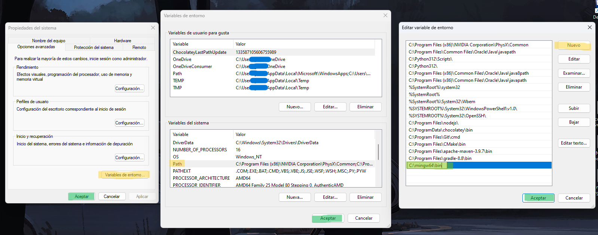

hecho esto tendremos finalmente configurado el compilador de c en nuestro ordenador, para verificarlo presionaremos las teclas `Win` + `R` y en el cuadro emergente escribiremos `powershell` y daremos enter. Dentro de powershell escribiremos lo siguente `gcc --version` y se tendra que mostrar la version del compilador.

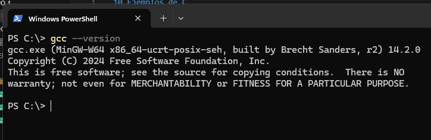

Hemos terminado la parte de configurar el compilador, ahora viene configurar Visual Studio Code.

#### Instalacion y configuracion de Visual Studio Code

La instalacion de VSCode es muy intuitiva, solo te dare el link directo a la descarga [Justo aqui](https://code.visualstudio.com/docs/?dv=win64user) y seguir las instrucciones de instalación.\
Una vez instalado selecciona el apartado extensiones en la barra lateral de la izquierda y busca la extension `Code Runner` hecho esto vamos a la configuracion de la extension y buscaremos la opcion `Run in Terminal`, tendremos que marcar esta opcion como activa unicamente presionando en el cuadro del checkmark.

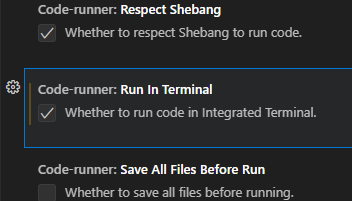

Finalmente buscaremos la opcion `Executor Map` y presionaremos en Editar settings.json, nos saltara un archivo json en el editor, dentro de este buscaremos la siguente linea:
```json
"cpp": "cd $dir && g++ $fileName -o $fileNameWithoutExt && $dir$fileNameWithoutExt"
```
la cual remmplazaremos por lo siguente:
```json
"cpp": "g++ '$dirWithoutTrailingSlash\\$fileName' -o '$workspaceRoot\\$fileNameWithoutExt' && start cmd \"/k ; $workspaceRoot\\$fileNameWithoutExt & echo. & pause & exit\" && exit"
```
De modo que quede algo parecido a esto:

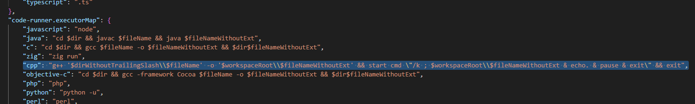

Guarda todo con `Ctrl` + `S` y unicamente tendras que presionar `Ctrl` + `Alt` + `N` para correr el codigo o presionar el boton de ejecutar en la parte superior derecha de la ventana

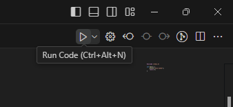

## Configurar Graphics

Graphics.h es una libreria que te ofrece una interfaz grafica, para hacer uso de la misma se necesita estar programando sobre 32 bits.\
En este repositorio te deje los unicos archivos necesarios para tener el modo grafico, los puedes encontrar sobre `10-ejemplos-C/archivos/graphics.h`

### Graphics en Dev-C++

Para configurar graphics.h en Dev-C++ lo primero sera descargar los archivos de la libreria que previamente se dijeron.\
Proximo a ello nos dirigiremos a la ruta donde descargamos dev-c++ (comunmente es `C:\Program Files (x86)\Dev-Cpp`).\
Una vez dentro ubicaremos las siguentes carpetas:

* [1] `C:\Program Files (x86)\Dev-Cpp\Templates`
  * Dentro de esta carpeta pegaremos los archivos `6-ConsoleAppGraphics.template` y `ConsoleApp_cpp_graph.txt`
* [2] `C:\Program Files (x86)\Dev-Cpp\MinGW64\include`
* [3] `C:\Program Files (x86)\Dev-Cpp\MinGW64\x86_64-w64-mingw32\include`
  * en estas dos rutas pegaremos los archivos que terminan en extension `.h` (graphics.h y winbgim.h)
* [4] `C:\Program Files (x86)\Dev-Cpp\MinGW64\lib`
* [5] `C:\Program Files (x86)\Dev-Cpp\MinGW64\x86_64-w64-mingw32\lib`
* [6] `C:\Program Files (x86)\Dev-Cpp\MinGW64\x86_64-w64-mingw32\lib32`
  * En estas tres ultimas pegaremos el archivo `libbgi.a`

Hecho esto abriremos la IDE.\
Dentro de la misma seleccionaremos en la barra superior que compilador queremos usar, en este caso sera el de 32 bits.

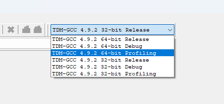

Hecho esto entraremos en el apartado herramientas y seleccionaremos la opcion `Opciones del compilador` en el cual tendremos que escribir las siguentes instrucciones en el apartado `Añadir estos comandos a la linea de comandos`.\
Comandos:
```
-static-libgcc -lbgi -lgdi32 -luuid -loleaut32 -lole32
```

nos quedara como lo muestra la imagen de abajo, hecho esto daremos en aceptar

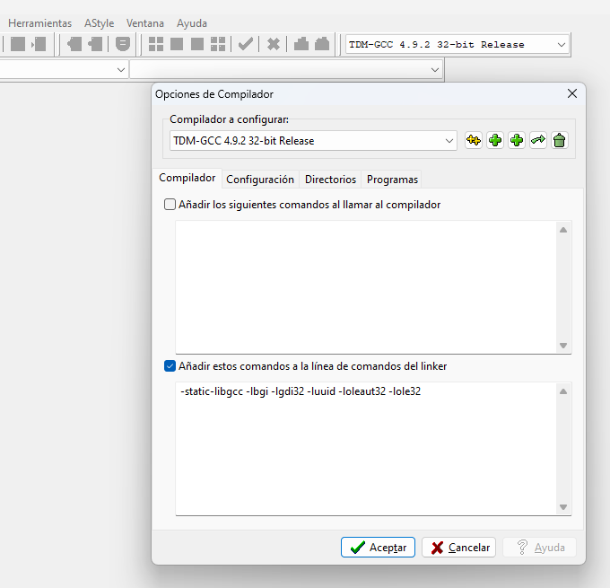

Con esto tendremos configurado el modo grafico, para la prueba ejecuta el ejemplo `holamundo_graphics.cpp` del repositorio.

### Graphics en Visual Studio Code

Al igual que con Dev-C++, para configurar graphics.h en VSCode lo primero sera descargar los archivos de la libreria que previamente se dijeron, y proximo a ello, nos dirigiremos a la carpeta donde previamente extrajimos mingw32.\
Una vez dentro ubicaremos las siguentes carpetas:

* [1] `C:\mingw32\include`
* [2] `C:\mingw32\i686-w64-mingw32\include`
  * en estas dos rutas pegaremos los archivos que terminan en extension `.h` (graphics.h y winbgim.h)
* [3] `C:\mingw32\lib`
* [4] `C:\mingw32\i686-w64-mingw32\lib`
  * En estas ultimas pegaremos el archivo `libbgi.a`

Hecho esto pasaremos a las configuraciones de la extension `Code Runner` en donde abriremos el settings.json del apartado `Executor Map`.

Hecho esto remplazaremos la linea que sustituimos anteriormente por la siguente
```json
"cpp": "g++ '$dirWithoutTrailingSlash\\$fileName' -o '$workspaceRoot\\$fileNameWithoutExt' -loleaut32 -lole32 -lbgi -lgdi32 -luuid && start cmd \"/k ; $workspaceRoot\\$fileNameWithoutExt & echo. & pause & exit\" && exit"
```

Hecho eso guardaremos los cambios y ya podremos ejecutar el modo grafico sobre Visual Studio Code.

#### Posible Error

Uno de los posibles errores al momento de querer importar la libreria graphics es que nos aparezca que no se puede abrir el archivo para importar la cabecera.\
Para solucionarlo mantendremos nuestro cursor en el error hasta que aparezca la opcion `Correccion Rapida` o podemos picar sobre la linea y presionar `Ctrl` + `.`\
Se nos desplegara el siguente cuadro en el cual seleccionaremos la opcion marcada:

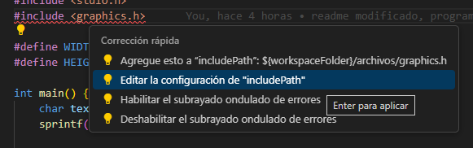

Dentro de las configuraciones buscaremos el apartado `Ruta de acceso de inclusión` en el cual tendremos un cuadro que por defecto tendra escrito `${workspaceFolder}/`. Borraremos lo que tiene escrito y pegaremos la ruta a las librerias de mingw32 `C:\mingw32\include`.

Al hacer esto se debio crear una carpeta llamada .vscode con un archivo llamado `c_cpp_properties.json` accede a este archivo y corrobora que en el apartado `includePath` se encuentre la ruta que pegamos.\
En caso de que no lo este, remplaza lo que se encuentre ahi por la ruta que copiamos, de modo que quede de esta manera:
```json
"includePath": [
    "C:\\mingw32\\include"
],
```
Hecho esto guardamos los cambios y el error deberia estar resuelto.

## Conclusiones

Ninguna, solo decir que si tienes algun error me lo comentes por alguno de los medios mencionados en [mi pagina web](https://www.nekoapi.line.pm/) (a exepcion de twitch o youtube), incluso por medio de aqui, github. Esto ayudaria a las personas que pueden tener tu mismo error.

Sin mas que decir

**Gracias**

Att. Kmz Kuro - @CacaoNk0027 